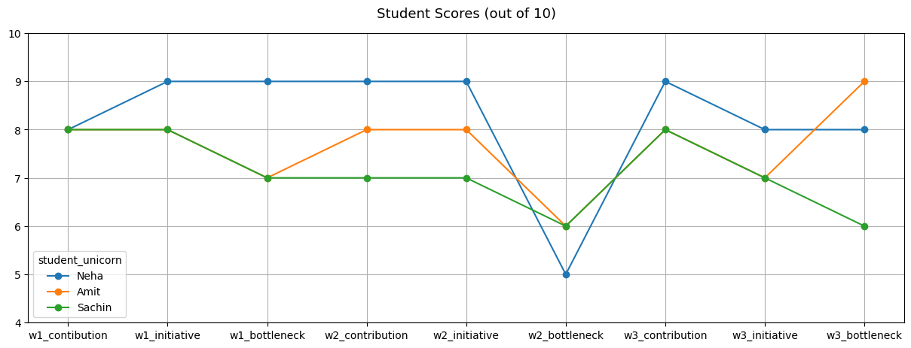
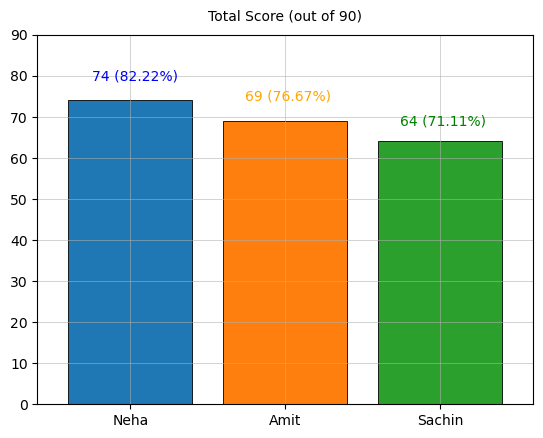
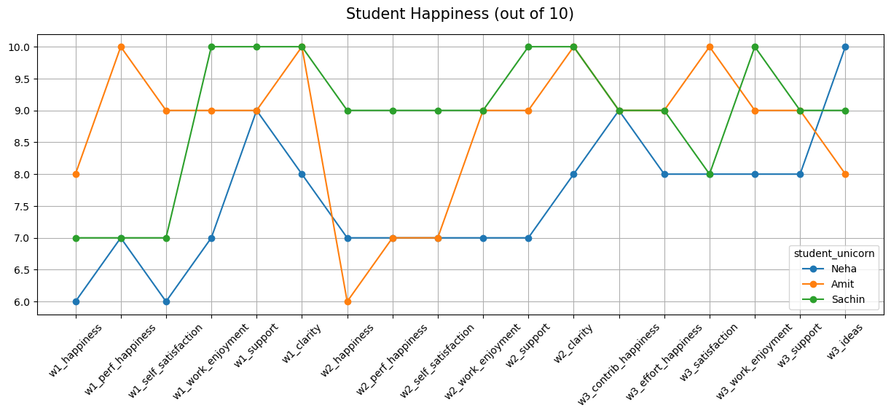
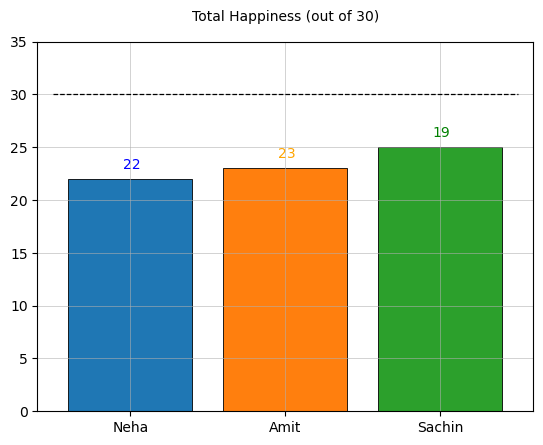
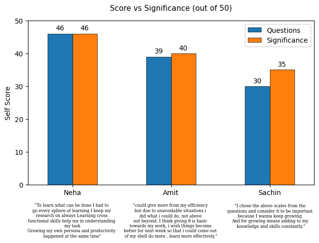

<h1><p style="text-align: center;"> Task 1: Data Visualization </p></h1>

---

This is my assignment for task 1 of DeepThought's Behavioral Data Scientist Fellowship Selection.

**Table of contents:**

- [Performance Data](#Peformance-Data)
- [Happiness Data](#Happiness-Data)
- [Progress Data](#Progress-Data)
  - [Week 1](#Week-1)
  - [Week 2](#Week-2)
  - [Week 3](#Week-3)


```python
import pandas as pd
import numpy as np
import matplotlib.pyplot as plt
```

## Peformance Data


```python
perf_df = pd.read_csv('performance_scorecard.csv', index_col='student_unicorn')
```


```python
perf_df
```


<div>
<style scoped>
    .dataframe tbody tr th:only-of-type {
        vertical-align: middle;
    }

    .dataframe tbody tr th {
        vertical-align: top;
    }

    .dataframe thead th {
        text-align: right;
    }
</style>
<table border="1" class="dataframe">
  <thead>
    <tr style="text-align: right;">
      <th></th>
      <th>w1_contibution</th>
      <th>w1_initiative</th>
      <th>w1_bottleneck</th>
      <th>w2_contribution</th>
      <th>w2_initiative</th>
      <th>w2_bottleneck</th>
      <th>w3_contribution</th>
      <th>w3_initiative</th>
      <th>w3_bottleneck</th>
    </tr>
    <tr>
      <th>student_unicorn</th>
      <th></th>
      <th></th>
      <th></th>
      <th></th>
      <th></th>
      <th></th>
      <th></th>
      <th></th>
      <th></th>
    </tr>
  </thead>
  <tbody>
    <tr>
      <th>Neha</th>
      <td>8</td>
      <td>9</td>
      <td>9</td>
      <td>9</td>
      <td>9</td>
      <td>5</td>
      <td>9</td>
      <td>8</td>
      <td>8</td>
    </tr>
    <tr>
      <th>Amit</th>
      <td>8</td>
      <td>8</td>
      <td>7</td>
      <td>8</td>
      <td>8</td>
      <td>6</td>
      <td>8</td>
      <td>7</td>
      <td>9</td>
    </tr>
    <tr>
      <th>Sachin</th>
      <td>8</td>
      <td>8</td>
      <td>7</td>
      <td>7</td>
      <td>7</td>
      <td>6</td>
      <td>8</td>
      <td>7</td>
      <td>6</td>
    </tr>
  </tbody>
</table>
</div>


```python
perf_df.T.plot(figsize=(15,5), marker='o', grid=True)

plt.title("Student Scores (out of 10)", font='sans serif', pad=15, size=13)
plt.ylim(4,10)
plt.show()
```


    

    


**Observations:**

- **Neha:** Her contribution and initiative has consistently been good. Her ability to identify bottlenecks and come up with solutions suffered drastically in week 2. From this graph, she looks like the best performer in this group.
- **Amit:** Amit's problem solving seems to be slightly above average in the first week, but seems to improves drastically by week 3. There doesn't seem to be significant improvement in the other parameters.
- **Sachin:** Sachin does not seem to show any improvement during this time. His problem solving performance seems to still be at the same level as it was in week 2.

I find it quite interesting how all three candidates' problem solving suffers in week 2. It could be that the problem given in week 2 was tougher compared to the other two weeks. 

Another interesting thing is that Neha seems to generally be good at problem solving, but she performed the worst in week 2. It is possible that the problem may have been especially challenging for her, maybe because of skill disparity.

Both Sachin and Neha have performed well with the bottleneck in the 3rd week. As only Sachin has suffered, it might have been due to personal reasons, or maybe skill disparity once more. But this is just speculation at this point.


```python
neha = perf_df.T.Neha.sum()
amit = perf_df.T.Amit.sum()
sachin = perf_df.T.Sachin.sum()

plt.grid(linewidth=0.4)
plt.bar('Neha', neha, edgecolor='black', linewidth=0.6)
plt.bar('Amit', amit, edgecolor='black', linewidth=0.6)
plt.bar('Sachin', sachin, edgecolor='black', linewidth=0.6)
plt.ylim(0, 90)

plt.text(-.25, 79, f'74 ({round(74*100/90, 2)}%)', color='blue')
plt.text(.74, 74, f'69 ({round(69*100/90, 2)}%)', color='orange')
plt.text(1.74, 68, f'64 ({round(64*100/90, 2)}%)', color='green')

plt.title('Total Score (out of 90)', font='sans serif', pad=10)
plt.xlim(-.6, 2.6)
plt.show()
```


    

    


**Observations:**

As we could see from the visuals in the previous graph, Neha scored the highest, Amit the second highest, and Sachin the third.

## Happiness Data


```python
happiness_df = pd.read_csv('happiness_scorecard.csv', index_col='student_unicorn')
```


```python
happiness_df
```


<div>
<style scoped>
    .dataframe tbody tr th:only-of-type {
        vertical-align: middle;
    }

    .dataframe tbody tr th {
        vertical-align: top;
    }

    .dataframe thead th {
        text-align: right;
    }
</style>
<table border="1" class="dataframe">
  <thead>
    <tr style="text-align: right;">
      <th></th>
      <th>w1_happiness</th>
      <th>w1_perf_happiness</th>
      <th>w1_self_satisfaction</th>
      <th>w1_work_enjoyment</th>
      <th>w1_support</th>
      <th>w1_clarity</th>
      <th>w2_happiness</th>
      <th>w2_perf_happiness</th>
      <th>w2_self_satisfaction</th>
      <th>w2_work_enjoyment</th>
      <th>w2_support</th>
      <th>w2_clarity</th>
      <th>w3_contrib_happiness</th>
      <th>w3_effort_happiness</th>
      <th>w3_satisfaction</th>
      <th>w3_work_enjoyment</th>
      <th>w3_support</th>
      <th>w3_ideas</th>
    </tr>
    <tr>
      <th>student_unicorn</th>
      <th></th>
      <th></th>
      <th></th>
      <th></th>
      <th></th>
      <th></th>
      <th></th>
      <th></th>
      <th></th>
      <th></th>
      <th></th>
      <th></th>
      <th></th>
      <th></th>
      <th></th>
      <th></th>
      <th></th>
      <th></th>
    </tr>
  </thead>
  <tbody>
    <tr>
      <th>Neha</th>
      <td>6</td>
      <td>7</td>
      <td>6</td>
      <td>7</td>
      <td>9</td>
      <td>8</td>
      <td>7</td>
      <td>7</td>
      <td>7</td>
      <td>7</td>
      <td>7</td>
      <td>8</td>
      <td>9</td>
      <td>8</td>
      <td>8</td>
      <td>8</td>
      <td>8</td>
      <td>10</td>
    </tr>
    <tr>
      <th>Amit</th>
      <td>8</td>
      <td>10</td>
      <td>9</td>
      <td>9</td>
      <td>9</td>
      <td>10</td>
      <td>6</td>
      <td>7</td>
      <td>7</td>
      <td>9</td>
      <td>9</td>
      <td>10</td>
      <td>9</td>
      <td>9</td>
      <td>10</td>
      <td>9</td>
      <td>9</td>
      <td>8</td>
    </tr>
    <tr>
      <th>Sachin</th>
      <td>7</td>
      <td>7</td>
      <td>7</td>
      <td>10</td>
      <td>10</td>
      <td>10</td>
      <td>9</td>
      <td>9</td>
      <td>9</td>
      <td>9</td>
      <td>10</td>
      <td>10</td>
      <td>9</td>
      <td>9</td>
      <td>8</td>
      <td>10</td>
      <td>9</td>
      <td>9</td>
    </tr>
  </tbody>
</table>
</div>


```python
ax = happiness_df.T.plot(figsize=(15,5), marker='o', grid=True)
ax.set_xticks(range(len(happiness_df.columns)))
ax.set_xticklabels(list(happiness_df.columns), rotation=45)
ax.set_title('Student Happiness (out of 10)', font='sans serif', pad=15, size=15)
plt.show()
```


    

    


**Observations:**

This graph is slightly messier, but we can still see some interesting things:

- **Neha:** Even though her performance was great in the first week, her happiness was quite low. Her happiness improved in week 2 even though it had one of her worst scores. It steadily increases up until the end. This could possibly be due to stress and maybe overwork, as her work enjoyment does not seem to be that high either. It is possible that she is someone who stresses about performance at work and sacrifices her happiness for it.

- **Amit:** Amit was extremely happy at the end of week 1, but not at the start of week 2. This could be due to personal reasons, or maybe the bottleneck in week 2? I don't really see any other patterns in this data that could enable me to speculate something about his personality. He seems to be a happy person on average.

- **Sachin:** Even though he has received the lowest score in this group, his happiness and satisfaction seem remain consistently high. It is possible that he is someone who doesn't stress a lot about work performance.

Until more data is available, it must be kept in mind that this is all just conjecture. Figuring out someone's personality just based on 3 weeks of work data in an excel sheet is most probably not going to reliable.


```python
neha_happiness = happiness_df.loc['Neha', 'w1_happiness'] + happiness_df.loc['Neha', 'w2_happiness'] + happiness_df.loc['Neha', 'w3_contrib_happiness']
amit_happiness = happiness_df.loc['Amit', 'w1_happiness'] + happiness_df.loc['Amit', 'w2_happiness'] + happiness_df.loc['Amit', 'w3_contrib_happiness']
sachin_happiness = happiness_df.loc['Sachin', 'w1_happiness'] + happiness_df.loc['Sachin', 'w2_happiness'] + happiness_df.loc['Sachin', 'w3_contrib_happiness']

plt.grid(linewidth=0.4)
plt.bar('Neha', neha_happiness, edgecolor='black', linewidth=0.6)
plt.bar('Amit', amit_happiness, edgecolor='black', linewidth=0.6)
plt.bar('Sachin', sachin_happiness, edgecolor='black', linewidth=0.6)
plt.ylim(0, 35)

plt.text(-.05, 23, '22', color='blue')
plt.text(.95, 24, '23', color='orange')
plt.text(1.95, 26, '25', color='green')

plt.title('Total Happiness (out of 30)', font='sans serif', pad=15)
plt.hlines(y=30, xmin=-.5, xmax=2.5, linestyle='--', color='black', linewidth=0.9)
plt.xlim(-.6, 2.6)
plt.show()
```


    

    


**Observation:**

Even though it looks like Amit may be much happier that Neha from the previous graph, we can see there is only a one point difference between them. That is why it is important to keep in mind that visual statistics can sometimes be deceptive, whether intentionally or unintentionally.

## Progress Data

So far, I have been dealing with numerical data, which mostly just requires simple quantitative analysis. The progress data of the candidates is textual, which means I'll have to do a qualitative analysis.

The ideal data in my opinion is a mixture of both quantitative and qualitative variables. Context gives meaning to numbers, and numbers give significance to context.

I have split this data into three different datasets for the 3 weeks, because it has a lot more features and a single dataframe would have been messy.

### Week 1


```python
week_1 = pd.read_csv('w1_candidate_progress.csv', index_col = 'student_unicorn')
```

**Questions:**

<p>Q1. How would you grade yourself in terms of the efforts you have put in completing projects at your company?</p>		
Q1. On a scale of 1-10, how much is the above parameter significant for you?	

<p>Q2. How much effort do you put in "learning and development of your core technical skills"?</p>	
Q2 On a scale of 1-10, compared to the other parameters, how much is the above parameter significant to you?	

<p>Q3 Beyond your core domain, what are the efforts have you put in learning holistically (cross functional skillset)?</p>
Q3 On a scale of 1-10, compared to the other parameters, how much is the above parameter significant to you?	

<p>Q4 What are the efforts have you given to improve your persona (developing your conversational and emotional intelligence)?</p>
Q4 On a scale of 1-10, compared to the other parameters, how much is the above parameter significant to you?

<p>Q5 How much efforts have you given in order to improve your efficiency or your productivity?</p>
Q5 On a scale of 1-10, compared to the other parameters, how much is the above parameter significant to you?

Can you elaborate on why did you chose  that scale while answering the above questions?

---

Here, I'm going to operate on the assumption that the **significance** is the candidate's ideal score. For example, learning and developing my core technical skills would have a significance of **10** for me, and so I would want my **effort** to be 10 as well. If my effort is not atleast equal to my significance, it would mean that I feel like I am underperforming.


```python
week_1
```


<div>
<style scoped>
    .dataframe tbody tr th:only-of-type {
        vertical-align: middle;
    }

    .dataframe tbody tr th {
        vertical-align: top;
    }

    .dataframe thead th {
        text-align: right;
    }
</style>
<table border="1" class="dataframe">
  <thead>
    <tr style="text-align: right;">
      <th></th>
      <th>q1</th>
      <th>q1_sig</th>
      <th>q2</th>
      <th>q2_sig</th>
      <th>q3</th>
      <th>q3_sig</th>
      <th>q4</th>
      <th>q4_sig</th>
      <th>q5</th>
      <th>q5_sig</th>
      <th>reasoning</th>
    </tr>
    <tr>
      <th>student_unicorn</th>
      <th></th>
      <th></th>
      <th></th>
      <th></th>
      <th></th>
      <th></th>
      <th></th>
      <th></th>
      <th></th>
      <th></th>
      <th></th>
    </tr>
  </thead>
  <tbody>
    <tr>
      <th>Neha</th>
      <td>10</td>
      <td>10</td>
      <td>9</td>
      <td>9</td>
      <td>9</td>
      <td>9</td>
      <td>9</td>
      <td>9</td>
      <td>9</td>
      <td>9</td>
      <td>"To learn what can be done I had to go every s...</td>
    </tr>
    <tr>
      <th>Amit</th>
      <td>8</td>
      <td>8</td>
      <td>7</td>
      <td>8</td>
      <td>8</td>
      <td>8</td>
      <td>8</td>
      <td>8</td>
      <td>8</td>
      <td>8</td>
      <td>could give more from my efficiency but due to ...</td>
    </tr>
    <tr>
      <th>Sachin</th>
      <td>6</td>
      <td>8</td>
      <td>4</td>
      <td>8</td>
      <td>7</td>
      <td>7</td>
      <td>7</td>
      <td>6</td>
      <td>6</td>
      <td>6</td>
      <td>I chose the above scales from the questions an...</td>
    </tr>
  </tbody>
</table>
</div>


I find it quite strange how none of the students have given a 10 to the significance of developing core technical skills, that is the **most** important thing in my opinion. And also to developing their persona. In the book "How To Win Friends and Influence People" by Dale Carnegie, he constantly stressed throughout the book upon how important social skills are, and how they can even even trump technical skills in the work place; which may be true as humans are social animals.

Setting a slightly lower significance on holistic learning, that I can somewhat understand. But not putting more emphasis on improving your effeciency or productivity baffles me, especially in the case of Sachin.

---

Now I'm going to take a look at how their total score matches up with their total significance.


```python
students = ['Neha', 'Amit', 'Sachin']

ques = [i for i in range(0,10) if i%2==0]
sig = [i for i in range(0,10) if i%2!=0]
answers = {
    'Questions': (week_1.iloc[0, ques].sum(), week_1.iloc[1, ques].sum(), week_1.iloc[2, ques].sum()),
    'Significance': (week_1.iloc[0, sig].sum(), week_1.iloc[1, sig].sum(), week_1.iloc[2, sig].sum()),
}

x = np.arange(len(students))  # the label locations
width = 0.25  # the width of the bars
multiplier = 0

fig, ax = plt.subplots(layout='constrained')

for attribute, measurement in answers.items():
    offset = width * multiplier
    rects = ax.bar(x + offset, measurement, width, label=attribute, align='edge', edgecolor='black', linewidth=.5)
    ax.bar_label(rects, padding=3)
    multiplier += 1

# Add some text for labels, title and custom x-axis tick labels, etc.
ax.set_ylabel('Self Score')
ax.set_title('Score vs Significance (out of 50)', pad=15, font='sans', size=11)
ax.set_xticks(x + width, students)
ax.legend(loc='upper right')
ax.set_ylim(0, 50)
ax.set_xlim(-.2, 2.7)

plt.text(0.25, -16, '"To learn what can be done I had to \ngo every sphere of learning I keep my \nresearch on always Learning cross \nfunctional skills help me in understanding \nmy task\nGrowing my own persona and productivity \nhappened at the same time"', horizontalalignment='center', size=6, font='serif')
plt.text(1.25, -16, '"could give more from my efficiency \nbut due to unavoidable situations i \ndid what i could do, not above \nnot beyond. I think giving 8 is basic \ntowards my work, i wish things become \nbetter for next week so that i could come out \nof my shell do more , learn more effectively."', horizontalalignment='center', size=6, font='serif')
plt.text(2.26, -13, '"I chose the above scales from the \nquestions and consider it to be important \nbecause I wanna keep growing. \nAnd for growing means adding to my \nknowledge and skills constantly."', horizontalalignment='center', size=6, font='serif')
plt.show()
```


    

    


A lower total score than total significance can indicate that the candidate feels that they are underperforming. If this feeling is perceived negatively by them, their self esteem could be lowered. Which would result in a [worse workplace performance](https://www.ncbi.nlm.nih.gov/pmc/articles/PMC9875080/)

> In addition, individuals present higher levels of happiness when they consider that their performance is better than usual (Fisher, 2010).

This quote from the same article indicates that a person who feels they put in the same level of (or more) effort as the significance they feel for the work would have higher levels of happiness. However, we can see that even though Neha believes she is putting in an amount of effort that matches the signifance she feels for the work during the first week, she scores her **happiness**, **performance happiness** and **self satsifaction** lower than expected.

From her elaboration on her answers, 

> "To learn what can be done I had to go every sphere of learning I keep my research on always Learning cross functional skills help me in understanding my task Growing my own persona and productivity happened at the same time" ***- Neha***

It does sound like she was working on a lot of things at the same time. It is possible she was overworking herself.

Conversely, in the case of Sachin during the first week, we can see that his happiness, performance happiness and self satisfaction are similar to Neha's, but his work enjoyment is much higher. Even though Neha is consistently performing better than him, he is happier than her.

> "I chose the above scales from the questions and consider it to be important because I wanna keep growing. And for growing means adding to my knowledge and skills constantly." ***- Sachin***

It is possible that Sachin derives happiness from learning new things and putting in effort; not necessarily from the outcomes. He also seems to be somewhat self aware by scoring his effort lower than the significance. It is possible he recognizes that he should put more effort in and improve his results.

For Amit, it seems he was going through some personal problems during this week,

> "could give more from my efficiency but due to unavoidable situations i did what i could do, not above not beyond. I think giving 8 is basic towards my work, i wish things become better for next week so that i could come out of my shell do more, learn more effectively." ***- Amit***

We can see that his performace scores do increase after the first week. Since he mentions coming out of his shell, it is possible he has some issues with socializing, as "coming out of my shell" is usually a phrase used for socializing more.


This concludes my analysis for the first week.

## Week 2


```python
week_2 = pd.read_csv('w2_candidate_progress.csv', index_col='student_unicorn')
```

**Problem Statement:**

Read this case carefully - "Raju and the team had one purpose X in order to solve a problem Y. Raju and the team brainstorms on what they can do to satisfy the purpose. They then mutually arrive at a conclusion that they have to do A, B and C works to meet that objective. Raju’s team lead then sits with the team to distribute the work among the team members. The team attaches a number+description to each work - M, N and O in order to get clarity on the deliverables. Lastly, the team sets three number+narratives - P, Q and R in order to verify if the work they would perform would actually create an impact or no."

**Questions:**


Q1 According to you, What does X represents in the story?  
Q2 According to you, What does A, B and C represent in the story?  
Q3 According to you, What does M, N and O represent in the story? (You can select more than one option)   
Q4 According to you, What does P, Q and R represent in the story? 

Can you elaborate on why did you chose  those options to answer the above questions? (Give one sentence reason for each one of the 4 questions)

**The scores given are out of 4.**


```python
week_2
```


<div>
<style scoped>
    .dataframe tbody tr th:only-of-type {
        vertical-align: middle;
    }

    .dataframe tbody tr th {
        vertical-align: top;
    }

    .dataframe thead th {
        text-align: right;
    }
</style>
<table border="1" class="dataframe">
  <thead>
    <tr style="text-align: right;">
      <th></th>
      <th>q1</th>
      <th>q2</th>
      <th>q3</th>
      <th>q4</th>
      <th>reasoning</th>
      <th>score</th>
    </tr>
    <tr>
      <th>student_unicorn</th>
      <th></th>
      <th></th>
      <th></th>
      <th></th>
      <th></th>
      <th></th>
    </tr>
  </thead>
  <tbody>
    <tr>
      <th>Neha</th>
      <td>The Problem statement which the company is pur...</td>
      <td>Deliverables to meet</td>
      <td>The Key Results of the work, The Key Performan...</td>
      <td>The Key Performance Indicators</td>
      <td>Many times company faces such challenges where...</td>
      <td>2</td>
    </tr>
    <tr>
      <th>Amit</th>
      <td>An Objective of the team</td>
      <td>Deliverables to meet</td>
      <td>Deliverables to meet, The numbers to chase in ...</td>
      <td>The Key Performance Indicators</td>
      <td>1. The purpose of X is nothing but knowing our...</td>
      <td>3</td>
    </tr>
    <tr>
      <th>Sachin</th>
      <td>An Objective of the team</td>
      <td>Deliverables to meet</td>
      <td>The numbers to chase in order to complete the ...</td>
      <td>The Key Performance Indicators</td>
      <td>1. X is the goal or purpose the team need to a...</td>
      <td>3</td>
    </tr>
  </tbody>
</table>
</div>


- From looking at the answers and the scores, it can be seen that Neha has scored **2/4**. From a quick look, it can be inferred seems she has answered **questions 1 and 3 wrongly**, as her answers to questions 2 and 4 match up with the others, and they got points for those. 

- Similarly, it can be ascertained that as Amit and Sachin have both received **3/4**, and since the only answer they have given differently is of **question 3, that is probably the answer they got wrong.**

Since **all the candidates had problems with question 3**, it makes sense to have a look at the question and their answers. And taking a look at their reasoning would also help understand their thinking. Other than these two features, I don't think the answers to the other questions need much analysis; we already know the correct answers for them.

---

**Excerpt:** "... The team attaches a number + description to each work - **M**, **N** and **O** in order to get clarity on the deliverables."

**Q3. According to you, What does M, N and O represent in the story? (You can select more than one option)**


**Neha's Response**

Answer:
> The Key Results of the work, The Key Performance Indicators, The numbers to chase in order to complete the deliverable, Deliverables to meet.

Reasoning:
> Many times company faces such challenges where innovation is only thing required, Apart company objectives, mission deliverables become so important to create some new milestone, For that we need The Key Results of the work The Key Performance Indicators The numbers to chase in order to complete the deliverable Deliverables to meet in aligned form, And in that case The Key Performance Indicators helps a lot as a base tool.

**Amit's response**

Answer:
> Deliverables to meet, The numbers to chase in order to complete the deliverable, The Key Results of the work

Reasoning:
> 1. The purpose of X is nothing but knowing our end goal i.e, the objective of team. 2. A, B & C are nothing but the deliverables to meet since the team had mutually decided to work on them. 3. M, N & O are our tracking metrics which help team to be on their toes to reach their targets 4. P , Q & R are key metrics which helps team to visualize what to work on and what can be kept on a bucket list.

**Sachin's response**

Answer:
> The numbers to chase in order to complete the deliverable, The Key Performance Indicators

Reasoning:
> 1. X is the goal or purpose the team need to achieved that is given by the higher authority in the company. 2.X goal is broken down into 3parts that is A B C .these are the 3 tasks that needs to be achieved by the team . 3.M N O are the exact numbers and their descriptions on how the tasks need to be done or achieved, these are the KPI s and numbers that the team need to achieve. 4.P Q R are the key performance indicators of the team ,they need to be achieved in order for a team to show its progress and it will allow them to track their performanc

---

It looks like these are MCQs, and two common options that I can see in their responses are 

- "The numbers to chase in order to complete the deliverable"
- "Deliverables to meet"

Interestingly, none of the candidates have selected just these two options. I do think selecting these two options should be the correct answer, as the excerpt mentions **numbers** and **deliverables**.

I suddenly wondered how ChatGPT would answer these, so I decided to run this problem statement and question through it:


And it agrees with me. However, I wouldn't rely upon its answers. My answer could still be wrong; I don't know enough about working in companies and the terminology associated with tasks.

This concludes my analysis for the second week.

## Week 3


```python
week_3 = pd.read_csv('w3_candidate_progress.csv', index_col='student_unicorn')
```


```python
week_3.rename(columns={'q2\n':'q2'}, inplace = True)
week_3
```


<div>
<style scoped>
    .dataframe tbody tr th:only-of-type {
        vertical-align: middle;
    }

    .dataframe tbody tr th {
        vertical-align: top;
    }

    .dataframe thead th {
        text-align: right;
    }
</style>
<table border="1" class="dataframe">
  <thead>
    <tr style="text-align: right;">
      <th></th>
      <th>q1</th>
      <th>q2</th>
      <th>q3</th>
      <th>q4</th>
      <th>q5</th>
      <th>q6</th>
      <th>q7</th>
      <th>q8</th>
    </tr>
    <tr>
      <th>student_unicorn</th>
      <th></th>
      <th></th>
      <th></th>
      <th></th>
      <th></th>
      <th></th>
      <th></th>
      <th></th>
    </tr>
  </thead>
  <tbody>
    <tr>
      <th>Neha</th>
      <td>around 75%</td>
      <td>half</td>
      <td>&gt;85%</td>
      <td>"So, as we're reaching to the final part of ou...</td>
      <td>Your prior academic/ technical skills, Help of...</td>
      <td>Academic/ technical skills, Learning from Work...</td>
      <td>All these holds wide impact to help us grow as...</td>
      <td>I can do double times contribution than this week</td>
    </tr>
    <tr>
      <th>Amit</th>
      <td>1</td>
      <td>&lt;25%</td>
      <td>&gt;85%</td>
      <td>Cause it was mutually decided in presence of o...</td>
      <td>Your prior academic/ technical skills, Help of...</td>
      <td>Learning from Workshops / Courses, Learning fr...</td>
      <td>Cross all the options gives broader perspectiv...</td>
      <td>I can do 1.25 times more contribution than thi...</td>
    </tr>
    <tr>
      <th>Sachin</th>
      <td>half</td>
      <td>half</td>
      <td>&gt;85%</td>
      <td>"This week was quite productive .I took initia...</td>
      <td>Your prior academic/ technical skills, Help of...</td>
      <td>Academic/ technical skills, Learning from Work...</td>
      <td>Everything mentioned above would help me grow ...</td>
      <td>I can do 1.5 times contribution than this week</td>
    </tr>
  </tbody>
</table>
</div>


**Questions:**

**Q1** On an average, What percentage of the work you did, was pre-planned?   
**Q2** What percentage of the work you did were unplanned, to give a freedom of exploration and initiate new ideas?   
**Q3** Roughly how much productive do you feel, what percentage of planned work were you able to complete?   
**Q4** Can you elaborate on why did you chose  those options to answer the above questions?   
**Q5** What did you utilize from the following to complete the work at your company? (You can select more than one option)   
**Q6** What among the following, according to you will help you as an individual to grow ahead in your future? (You can select more than one option)   
**Q7** Why would it help you to grow? How would you utilize them to grow at the fullest potential?   
**Q8** Do you think that you can do better / more contributions than what you mentioned above? How many times better can you perform?

The answers to questions 1, 2, 3 and 8 are already clearly visibly in the dataset. I'll also skip questions 5 and 7 as they are just MCQs. Let's take a look at the rest.

---

**Q4 Can you elaborate on why did you chose  those options to answer the above questions?**

**Neha:**
> "So, as we're reaching to the final part of our internship we finalized our final agenda "Digital Media Marketing" is one of the main KPI's on our bucket list -Regarding this, we as a team decide what we plan to do : Content Front 1) One time it could be creating a strategy report. 2) Another time it could be creating post content & have a discussion around it. 3) Some other time it could be designing analytics for the posts we've created and sharing our thoughts on that analysis stating where we can improve better so on and so forth ... so as our agenda is clear we will decide what can be planned this week as a part of KPI/OKR's. Coming back to the point there's a Product front as well. So every week I will be receiving the upcoming week's plan - Features to be worked on kind of Plan of Action for internal team members (Dreamworks.co). I need to know how it works and come up with Feature documentation where Amit started to join the club recently and created the same old pattern which I started. 1)Personas 2)User Story 3)User Flow. Upon our Lead's suggestion we added one more aspect 4) Use case scenarios. So as you can see this is the combination of our plan+ Seniors delegation to work on !"

**Amit:**
> "Cause it was mutually decided in presence of our lead and then we were assigned to the tasks. That is why I chose that option. There is nothing else to mention"

**Sachin:**
> "This week was quite productive. I took initiatives to take up work like working on the new feature list. Extened my research on my previous competitive analysis with new prespective and websites. Worked on more than 20+ feature list wrote product initiatives documents for them . Helped the team with brainstorming ideas for LinkedIn post as well, the week was fun and productive. I feel I worked efficiently this week and hope to continue to do so in upcoming week."


**Q7 Why would it help you to grow? How would you utilize them to grow at the fullest potential?**

(All of them have selected similar responses in the previous question)

**Neha:** 

**Q6 Answer:** Academic/ technical skills, Learning from Workshops / Courses, Learning from Cross-functional Holistic Sessions, Help received currently from the team, Your creative initiatives and innovative solutions, Help of mentor / senior organization
> "All these holds wide impact to help us grow as an individual also as an team player who can help others to get in same boat from where the development becomes a key factor across the eco-system."

**Amit:**

**Q6 Answer:** Learning from Workshops / Courses, Learning from Cross-functional Holistic Sessions, Your creative initiatives and innovative solutions, Help of mentor / senior organization
> "Cross all the options gives broader perspectives to nurture and innovate"

**Sachin:**

**Q6 Answer:** Academic/ technical skills, Learning from Workshops / Courses, Learning from Cross-functional Holistic Sessions, Help received currently from the team, Your creative initiatives and innovative solutions, Help of mentor / senior organization
> "Everything mentioned above would help me grow, learn new things and will allow me to contribute to my organisation"

---

I find it funny that Neha says that she can do twice the amount of contributions than this week, even though she scored a 9 for this week's contribution.

I don't see any substantial insights for this week. Sure, it looks like Amit did not get much freedom to experiment and be creative, and his response to question 4 does make him sound a little disappointed. I can also see that none of them really answered question number 6 completely.

I also feel like I may be overdoing this analysis, and that I've taken a little too long to complete all this. So, it might be prudent to end it here for now.

This, although abruptly, concludes my week 3 analysis. And thus, this task.
